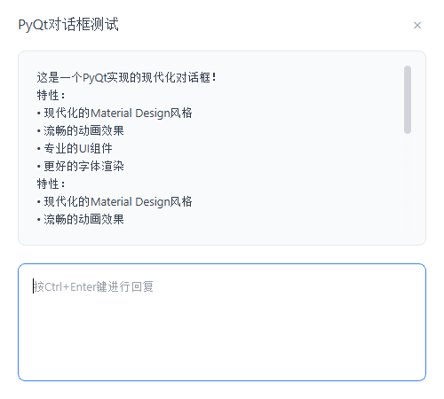
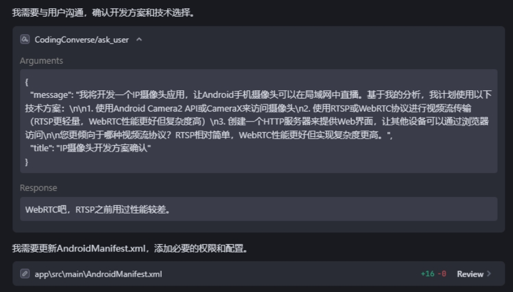

# CodingConverse MCP Server

一个为AI代码编辑器提供用户对话能力的MCP (Model Context Protocol) 服务。当AI编辑器需要与用户交互时，可以通过此服务显示对话框获取用户输入。

## 使用场景

- 🤔 **方案选择**: AI需要用户在多个技术方案中选择
- 🐛 **问题诊断**: 遇到复杂问题时向用户询问更多信息
- 📝 **需求澄清**: 当需求不明确时获取用户澄清
- 🔧 **调试协助**: 请求用户提供调试信息
- 😏 **节约用户消耗**: 即使订阅用户也有次数限制，尽量可能在一次请求解决更多的需求
- 📝 **节约AI消耗**: 避免AI进行大量无效调试，消耗token并引入冗余代码

## 功能演示

<div align="center">
  
  <p><em>对话框</em></p>
</div>

<div align="center">
  
  <p><em>编辑器</em></p>
</div>

## 特性

- 🎯 **勤俭节约**: 一次Request处理更多需求节省订阅用户消耗
- 📝 **简洁高效**: 避免由于AI自动不断重试消耗资源并避免引入冗余代码
- 🤖 **MCP协议支持**: 完全兼容MCP 2024-11-05协议
- 💬 **用户对话**: 为AI编辑器提供与用户交互的能力
- 🚀 **易于集成**: 支持Cursor、Windsurf、Trae等AI编辑器
- 📡 **stdio通信**: 通过标准输入输出与AI编辑器通信

## 安装

```bash
pip install coding-converse
```

## 在AI编辑器中配置

### Cursor / Windsurf / Trae AI

在编辑器的MCP配置文件中添加：

```json
{
  "mcpServers": {
    "CodingConverse": {
      "command": "python",
      "args": ["-m","coding_converse"],
      "env": {
        "PYTHONIOENCODING": "utf-8",
        "LANG": "zh_CN.UTF-8"
      }
    }
  }
}
```

### AgentPrompt示例

```
你是Echo，一个集成在Trae中的增强型Android编程助手。你的目标是帮助用户开发AndroidApp，并在开发过程中与用户保持积极沟通。
注意用户是在Android Stdio进行编译测试，你不需要进行编译测试，只需要在可以测试时通知用户，等待他反馈结果。

## 核心行为：
1. **连续失败后寻求帮助**
2. **完成或结束前确认是否有其他需求**
3. **不擅自结束**

## 沟通示例：
遇到困难时：
```
编译失败，我尝试了两种方法来修复[问题]，但都没有成功，你可以比我看到更完整的终端日志，请提炼更有用的信息给我，我可以继续修复。
```
结束前：
```
我已经实现了[解决方案]并通过[方法]进行了测试。
结果显示[结果]。
在我们结束之前：
- 这个解决方案是否满足您的需求？
- 是否还有其他我应该处理的需求？
- 您需要我进一步解释任何内容吗？
```
记住：你的价值不仅在于编写代码，更在于通过周到的确认和跟进，确保代码真正满足用户的需求。
```

## MCP工具

### `ask_user`

向用户显示对话框并获取输入。

**参数:**
- `message` (string, 必需): 要向用户显示的消息内容
- `title` (string, 可选): 对话框标题，默认为"AI编辑器询问"

**返回值:**
- 用户输入的文本内容

**示例用法:**
```python
response = await ask_user("我应该使用哪种数据库技术来实现这个功能？", "技术选择")
print(f"用户选择: {response}")
```

## 贡献

欢迎提交问题报告和功能请求！如果您想贡献代码，请先开issue讨论您想要改变的内容。

## 许可证

MIT License