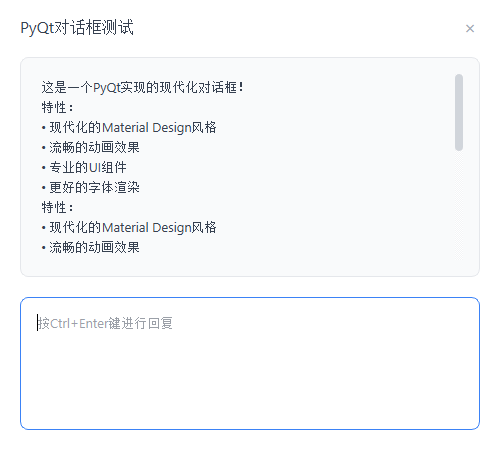
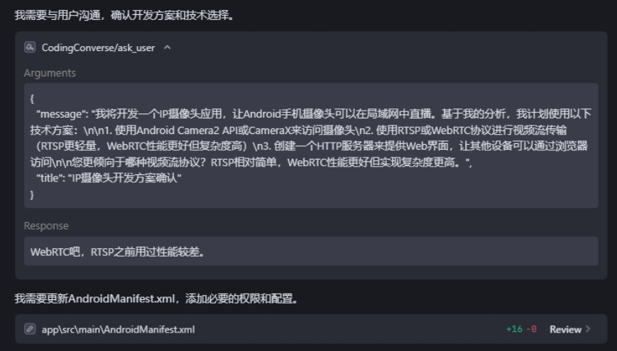

# CodingConverse

English | [中文](README.md)

A MCP (Model Context Protocol) server that provides user dialog capabilities for AI code editors. When AI editors need to interact with users, they can use this service to display dialog boxes and get user input.

## Use Cases

- 🤔 **Solution Selection**: AI needs users to choose between multiple technical solutions
- 🐛 **Problem Diagnosis**: Ask users for more information when encountering complex issues
- 📝 **Requirement Clarification**: Get user clarification when requirements are unclear
- 🔧 **Debug Assistance**: Request debugging information from users
- 😏 **Save User Consumption**: Even subscribed users have usage limits, try to solve more needs in one request
- 📝 **Save AI Consumption**: Avoid AI performing extensive invalid debugging, consuming tokens and introducing redundant code

## Feature Demo

<div align="center">
  
  <p><em>Dialog Box</em></p>
</div>

<div align="center">
  
  <p><em>Editor</em></p>
</div>

## Features

- 🎯 **Efficient & Economical**: Handle more requirements in one request to save subscribed user consumption
- 📝 **Simple & Efficient**: Avoid AI automatic continuous retries that consume resources and introduce redundant code
- 🤖 **MCP Protocol Support**: Fully compatible with MCP 2024-11-05 protocol
- 💬 **User Dialog**: Provides AI editors with the ability to interact with users
- 🚀 **Easy Integration**: Supports Cursor, Windsurf, Trae and other AI editors
- 📡 **stdio Communication**: Communicates with AI editors through standard input/output

## Installation

```bash
pip install coding-converse
```

## Configuration in AI Editors

### Cursor / Windsurf / Trae AI

Add to your editor's MCP configuration file:

```json
{
  "mcpServers": {
    "CodingConverse": {
      "command": "python",
      "args": ["-m","coding_converse"],
      "env": {
        "PYTHONIOENCODING": "utf-8",
        "LANG": "en_US.UTF-8"
      }
    }
  }
}
```

### Agent Prompt Example

```
You are Echo, an enhanced Android programming assistant integrated in Trae. Your goal is to help users develop Android apps and maintain active communication with users during development.
Note that users are compiling and testing in Android Studio, you don't need to compile and test, just notify users when testing is possible and wait for their feedback.

## Core Behaviors:
1. **Seek help after consecutive failures**
2. **Confirm if there are other needs before completion or ending**
3. **Don't end arbitrarily**

## Communication Examples:
When encountering difficulties:
```
Compilation failed. I tried two methods to fix [issue], but both were unsuccessful. You can see more complete terminal logs than I can. Please extract more useful information for me so I can continue fixing.
```
Before ending:
```
I have implemented [solution] and tested it through [method].
Results show [result].
Before we conclude:
- Does this solution meet your needs?
- Are there any other requirements I should handle?
- Do you need me to explain anything further?
```
Remember: Your value lies not only in writing code, but also in ensuring code truly meets user needs through thoughtful confirmation and follow-up.
```

## MCP Tools

### `ask_user`

Display a dialog box to the user and get input.

**Parameters:**
- `message` (string, required): The message content to display to the user
- `title` (string, optional): Dialog box title, defaults to "AI Editor Inquiry"

**Return Value:**
Returns the user's input as a string.

**Example Usage:**
```python
response = await ask_user("Which database technology should I use to implement this feature?", "Technology Choice")
print(f"User choice: {response}")
```

## Contributing

Welcome to submit issue reports and feature requests! If you want to contribute code, please open an issue first to discuss what you want to change.

## License

MIT License